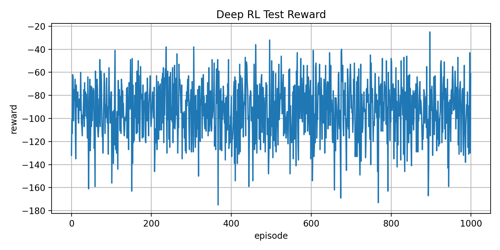
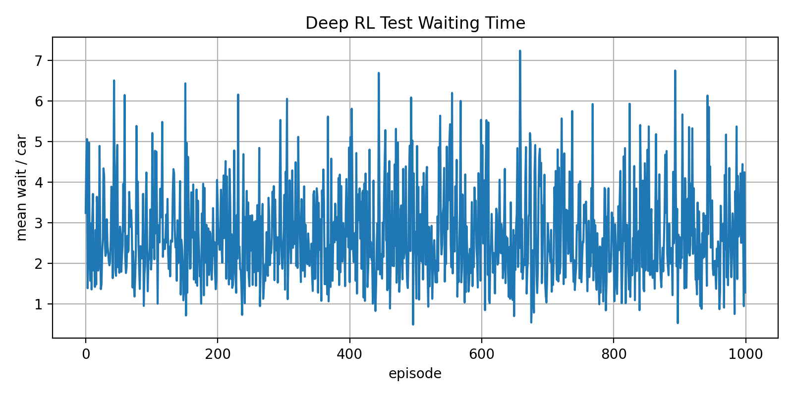
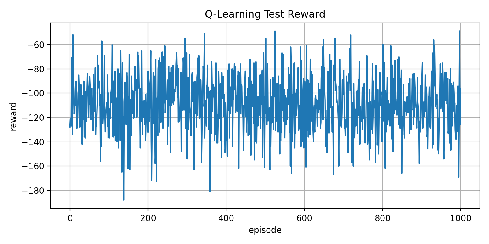
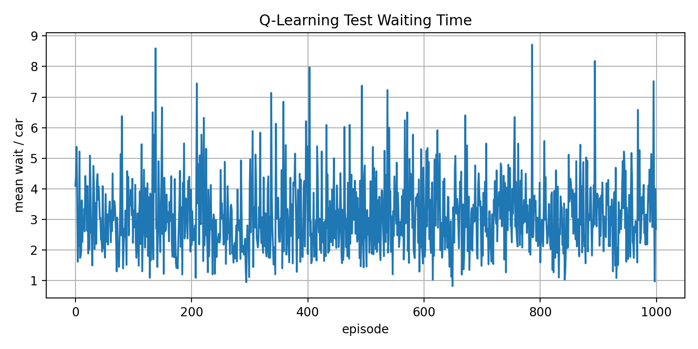

# Intelligent Traffic Signal Control Using Deep Reinforcement Learning

## Project Overview

This project investigates the application of reinforcement learning (RL) and deep reinforcement learning (DRL) to intelligent traffic signal control in a simulated traffic environment.

The project implements and evaluates two reinforcement learning approaches:

- **Q-Learning:** A traditional tabular reinforcement learning approach.
- **Deep Q-Network (DQN):** A deep reinforcement learning approach that uses a neural network to approximate action-value functions.

The objective is to investigate how reinforcement learning agents can make traffic signal control decisions and improve traffic management.

## Project Objectives

- Develop a simulation environment for traffic signal control.
- Implement Q-Learning and Deep Q-Network (DQN).
- Train reinforcement learning agents to optimize traffic signal decisions.
- Evaluate performance using cumulative rewards and vehicle waiting times.
- Visualize and compare the performance of both approaches.

## Technologies Used

- Python
- Reinforcement Learning
- Deep Reinforcement Learning
- Q-Learning
- Deep Q-Network (DQN)
- NumPy
- TensorFlow / Keras
- Matplotlib
- Streamlit

## Project Structure

```text
Deep-RL-Traffic-Signal-Control/
│
├── deepRL_env.py          # DQN training
├── qlearning_env.py       # Q-Learning training
├── test_deep.py           # DQN evaluation
├── test_qlearning.py      # Q-Learning evaluation
├── traffic_data_env.py    # Traffic data generation
├── streamlit_app.py       # Results visualization
│
├── deep1.h5               # Trained DQN model
├── qtable-same-0.9.pickle # Trained Q-table
│
├── figures/               # Experimental visualizations
├── README.md
└── .gitignore
```
## Installation

Clone the repository:

```bash
git clone https://github.com/zahraKrm/Deep-RL-Traffic-Signal-Control.git
cd Deep-RL-Traffic-Signal-Control
```

Install the required dependencies:

```bash
pip install -r requirements.txt
```

## Usage

### 1. Generate Traffic Data

```bash
python traffic_data_env.py
```

### 2. Train the Q-Learning Agent

```bash
python qlearning_env.py
```

### 3. Train the DQN Agent

```bash
python deepRL_env.py
```

### 4. Evaluate the Trained Models

```bash
python test_qlearning.py
python test_deep.py
```

### 5. Launch the Visualization Dashboard

```bash
streamlit run streamlit_app.py
```

## Evaluation Metrics

The implemented approaches are evaluated using:

- **Episode Rewards:** Measures the rewards obtained by the agent during simulation.
- **Vehicle Waiting Time:** Measures traffic delays in the simulated environment.

## Experimental Results

The following figures illustrate the experimental results.

### Deep Q-Network (DQN)

**Episode Rewards**



**Vehicle Waiting Time**



### Q-Learning

**Episode Rewards**



**Vehicle Waiting Time**



## Future Improvements

Potential future extensions include:

- Testing additional reinforcement learning algorithms.
- Evaluating performance under different traffic conditions.
- Extending the simulation to more complex traffic networks.
- Improving the generalization of trained agents.

## Author

Developed as a personal academic project exploring reinforcement learning for intelligent traffic signal control.
